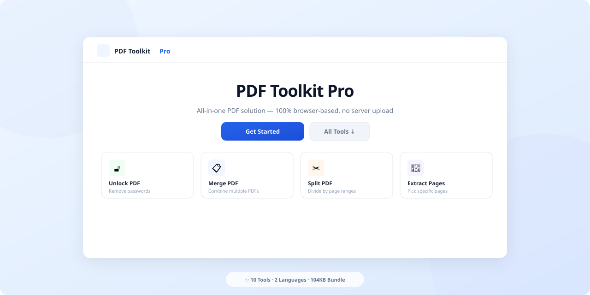
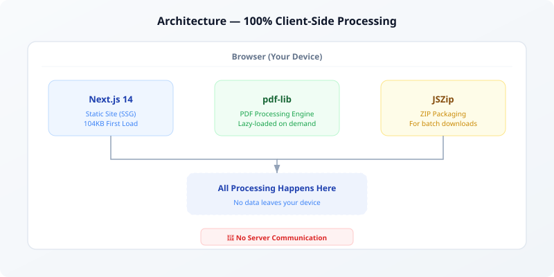

<div align="center">



# PDF Toolkit Pro

**The open-source, privacy-first PDF toolkit that runs entirely in your browser.**

No server uploads. No sign-ups. No limits. Just fast, secure PDF processing.

[](LICENSE)
[](https://nextjs.org)
[](https://typescriptlang.org)
[](/)
[](CONTRIBUTING.md)

[**Live Demo**](https://pdftoolkit.pro) · [Report Bug](https://github.com/concrete-sangminlee/pdfremover/issues) · [Request Feature](https://github.com/concrete-sangminlee/pdfremover/issues)

</div>

---

## Why PDF Toolkit Pro?

Most online PDF tools upload your files to remote servers. **PDF Toolkit Pro processes everything locally in your browser** using WebAssembly-powered [pdf-lib](https://pdf-lib.js.org/). Your files never leave your device.

| | PDF Toolkit Pro | iLovePDF / SmallPDF |
|---|:---:|:---:|
| **100% Browser Processing** | ✅ | ❌ |
| **No Server Upload** | ✅ | ❌ |
| **No Sign-up Required** | ✅ | ❌ (limited) |
| **Completely Free** | ✅ | ❌ (freemium) |
| **Open Source** | ✅ | ❌ |
| **Works Offline** | ✅ | ❌ |
| **First Load Size** | 104 KB | 2+ MB |

---

## 10 Professional Tools

<table>
<tr>
<td align="center" width="20%">🔓<br><b>Unlock</b><br><sub>Remove passwords & restrictions<br>Batch support</sub></td>
<td align="center" width="20%">📋<br><b>Merge</b><br><sub>Combine multiple PDFs<br>Drag to reorder</sub></td>
<td align="center" width="20%">✂️<br><b>Split</b><br><sub>Divide by page ranges<br>or individual pages</sub></td>
<td align="center" width="20%">📄<br><b>Extract</b><br><sub>Pick specific pages<br>Custom ranges</sub></td>
<td align="center" width="20%">🔄<br><b>Rotate</b><br><sub>90° / 180° / 270°<br>All or specific pages</sub></td>
</tr>
<tr>
<td align="center">📦<br><b>Optimize</b><br><sub>Strip metadata<br>Reduce file size</sub></td>
<td align="center">💧<br><b>Watermark</b><br><sub>Text watermarks<br>Tiled / Center / Diagonal</sub></td>
<td align="center">🔢<br><b>Page Numbers</b><br><sub>Auto-numbering<br>5 positions, 2 formats</sub></td>
<td align="center">🗑️<br><b>Delete Pages</b><br><sub>Remove unwanted pages<br>With confirmation</sub></td>
<td align="center">ℹ️<br><b>PDF Info</b><br><sub>Metadata viewer<br>One-click copy</sub></td>
</tr>
</table>

---

## Architecture



**Key design decisions:**

- **Dynamic imports** — `pdf-lib` (225KB) and `jszip` (100KB) are lazy-loaded only when a tool is actually used, keeping the initial bundle at just **104KB**
- **Static Site Generation** — All 16 pages are pre-rendered at build time for instant loading
- **Zero backend** — No API routes, no database, no server-side processing. Deploy anywhere that serves static files
- **SEO-first routing** — Each tool has its own URL (`/unlock`, `/merge`, etc.) with dedicated meta tags, Open Graph, and structured data

---

## Features

### User Experience
- 🌐 **Bilingual** — Full Korean + English support with auto-detection from `navigator.language`
- 📱 **Mobile-first** — Fixed bottom CTA bar, responsive comparison table, touch-friendly 44px targets
- ⌨️ **Keyboard shortcuts** — `Esc` to go home (guarded during processing)
- 🔄 **Batch processing** — Upload multiple PDFs for batch unlock with progress indicator
- 📊 **Smart context** — Page count hints, file size warnings (>50MB), processing time display
- 🔗 **Share** — Native share API on mobile, clipboard fallback on desktop
- 🎯 **Contextual suggestions** — Related tools based on what you just used

### Technical
- ⚡ **104KB First Load** — 67% smaller than initial build through dynamic imports
- 🏗️ **16 static pages** — Pre-rendered with `generateStaticParams`
- 🔍 **Full SEO** — Sitemap, robots.txt, per-tool meta tags, JSON-LD structured data
- 📲 **PWA ready** — Web app manifest, SVG favicon, Apple mobile web app support
- ♿ **Accessible** — `aria-labels`, `focus-visible` rings, semantic HTML, WCAG AA contrast
- 🛡️ **Error boundaries** — Graceful error recovery with custom error and 404 pages
- 💾 **Persistent state** — Language, history, and processed count stored in `localStorage`

---

## Quick Start

### Prerequisites

- Node.js 18+
- npm or yarn

### Development

```bash
# Clone the repository
git clone https://github.com/concrete-sangminlee/pdfremover.git
cd pdfremover

# Install dependencies
npm install

# Start development server
npm run dev
```

Open [http://localhost:3000](http://localhost:3000) in your browser.

### Production Build

```bash
npm run build
npm start
```

### Deploy to Vercel

[](https://vercel.com/new/clone?repository-url=https://github.com/concrete-sangminlee/pdfremover)

One-click deploy. No configuration needed.

---

## Project Structure

```
app/
├── page.tsx                 # Home page (tool grid)
├── [tool]/page.tsx          # Dynamic tool routes with per-tool SEO
├── components/
│   └── toolkit-app.tsx      # Main client component (all UI + logic)
├── lib/
│   └── config.ts            # Shared types, tool definitions, colors
├── layout.tsx               # Root layout, meta tags, fonts
├── globals.css              # Design system (Tailwind + custom)
├── sitemap.ts               # Dynamic sitemap generation
├── robots.ts                # Robots.txt generation
├── error.tsx                # Error boundary
└── not-found.tsx            # 404 page
public/
├── manifest.json            # PWA manifest
└── icon.svg                 # SVG favicon
```

## Tech Stack

| Technology | Purpose |
|-----------|---------|
| [Next.js 14](https://nextjs.org) | Framework (Static Site Generation) |
| [React 18](https://react.dev) | UI library |
| [TypeScript 5](https://typescriptlang.org) | Type safety |
| [Tailwind CSS 3](https://tailwindcss.com) | Styling |
| [pdf-lib](https://pdf-lib.js.org) | PDF processing (client-side) |
| [JSZip](https://stuk.github.io/jszip/) | ZIP packaging for batch downloads |

---

## Contributing

Contributions are welcome! Here are some ways you can help:

- 🐛 **Report bugs** — [Open an issue](https://github.com/concrete-sangminlee/pdfremover/issues)
- 💡 **Suggest features** — [Start a discussion](https://github.com/concrete-sangminlee/pdfremover/issues)
- 🔧 **Submit PRs** — Fork, branch, commit, and open a pull request
- 🌍 **Add translations** — Help us support more languages
- 📝 **Improve docs** — Fix typos, add examples, clarify instructions

### Development Guidelines

1. **No server-side processing** — All PDF operations must run in the browser
2. **Keep bundle small** — Use dynamic imports for heavy libraries
3. **Bilingual** — All user-facing strings must be in both Korean and English
4. **Accessible** — Follow WCAG AA guidelines
5. **Mobile-first** — Test on mobile viewports

---

## Roadmap

- [ ] PDF to Images conversion (using canvas/pdfjs)
- [ ] Image to PDF conversion
- [ ] PDF password protection (encryption)
- [ ] Dark mode toggle
- [ ] More languages (Japanese, Chinese, Spanish)
- [ ] Service worker for offline support
- [ ] Unit tests for PDF operations
- [ ] Performance benchmarks vs competitors

---

## License

This project is licensed under the [MIT License](LICENSE).

---

<div align="center">

**Built with ❤️ for privacy-conscious users worldwide.**

If you find this useful, please consider giving it a ⭐

</div>
